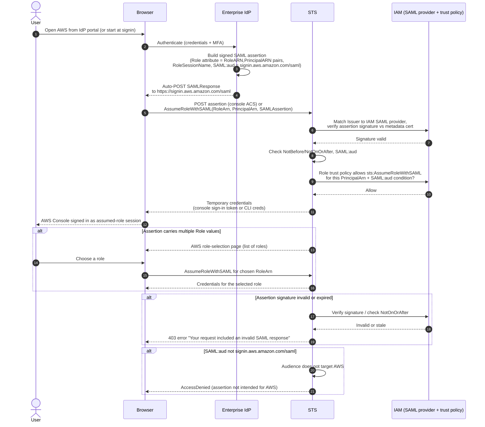

# AssumeRoleWithSAML — Sequence Diagram

Happy path first: SP-initiated SSO where AWS is the SP, ending in temporary credentials
and the console. Then alternates: multiple roles to choose from, invalid/expired
assertion, and an audience mismatch.

Notes

- AWS acts as the SAML SP; the browser exchange mirrors generic
  [SP-initiated SSO](../../../saml/sp-initiated-sso/README.md).
- The `PrincipalArn` in `AssumeRoleWithSAML` is the IAM SAML provider ARN, not a user; the
  `RoleArn` is the role to assume — both arrive paired in the `Role` attribute.
- The `SAML:aud` check plus the assertion signature are what prevent replaying an assertion
  minted for a different service provider.
