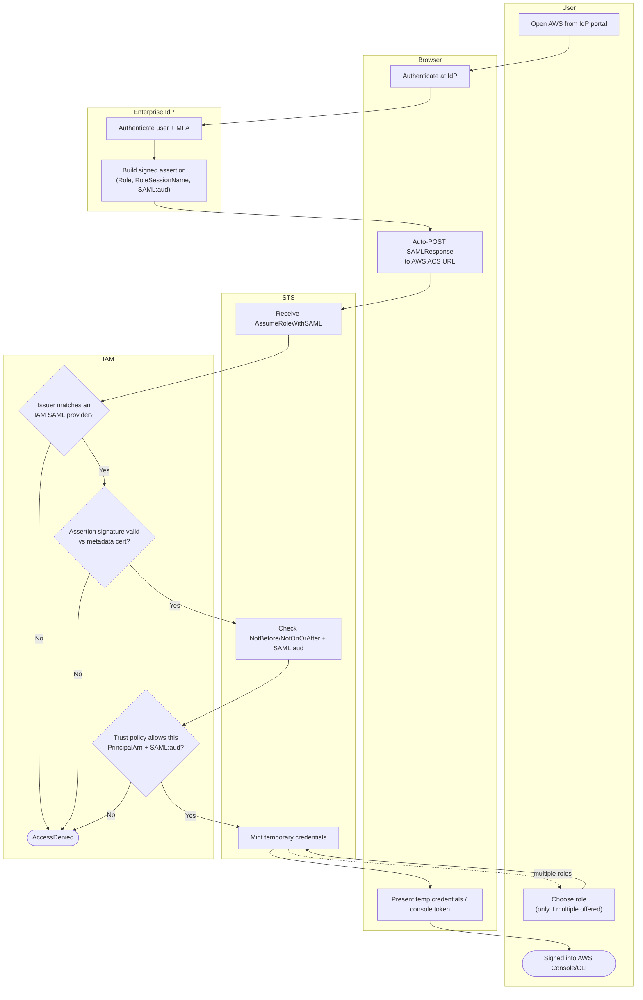

# AssumeRoleWithSAML — Swimlane Diagram

One lane per actor. The signed assertion crosses from the IdP through the browser to STS.

Notes

- AWS is the SAML SP; the IAM lane holds the SAML provider metadata (`M1`, `M2`) and the
  role trust policy (`M3`).
- The role-selection loop (`U2`) only appears when the assertion carries more than one
  `Role` attribute value.
- For central multi-account assignment instead of one role per account, see
  [IAM Identity Center](../iam-identity-center-sso/README.md).
