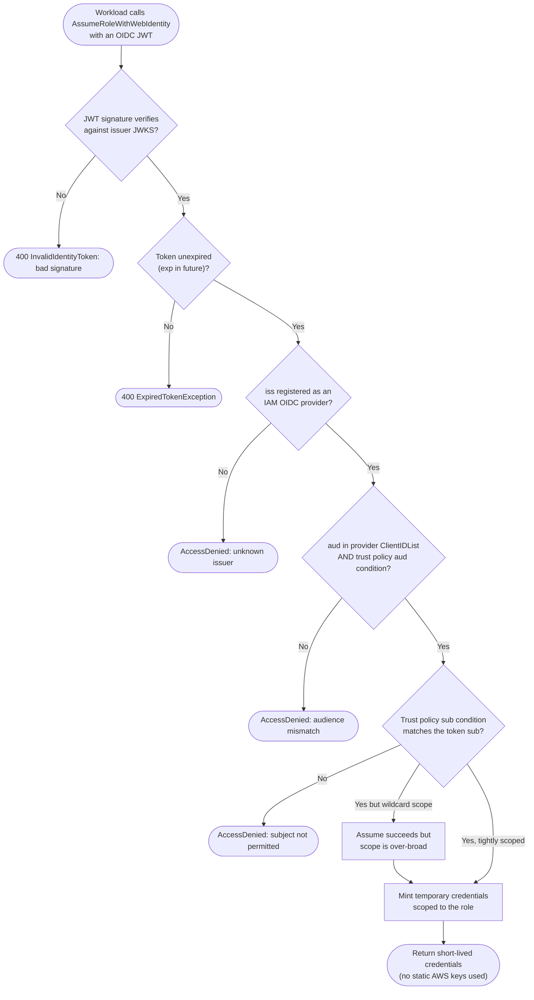

# AssumeRoleWithWebIdentity — Decision Flowchart

Token validation and trust-policy claim gates, ending in credentials or explicit denials.

Notes

- The signature/exp gates are done by STS via JWKS; the `aud`/`sub` gates are the trust
  policy conditions you author.
- The wildcard-`sub` branch is drawn deliberately: it still succeeds, which is why it is a
  finding, not an error — tighten `sub` to a specific repo/ref/environment.
- No AWS signature is checked on the call itself; the JWT is the entire proof of identity.
