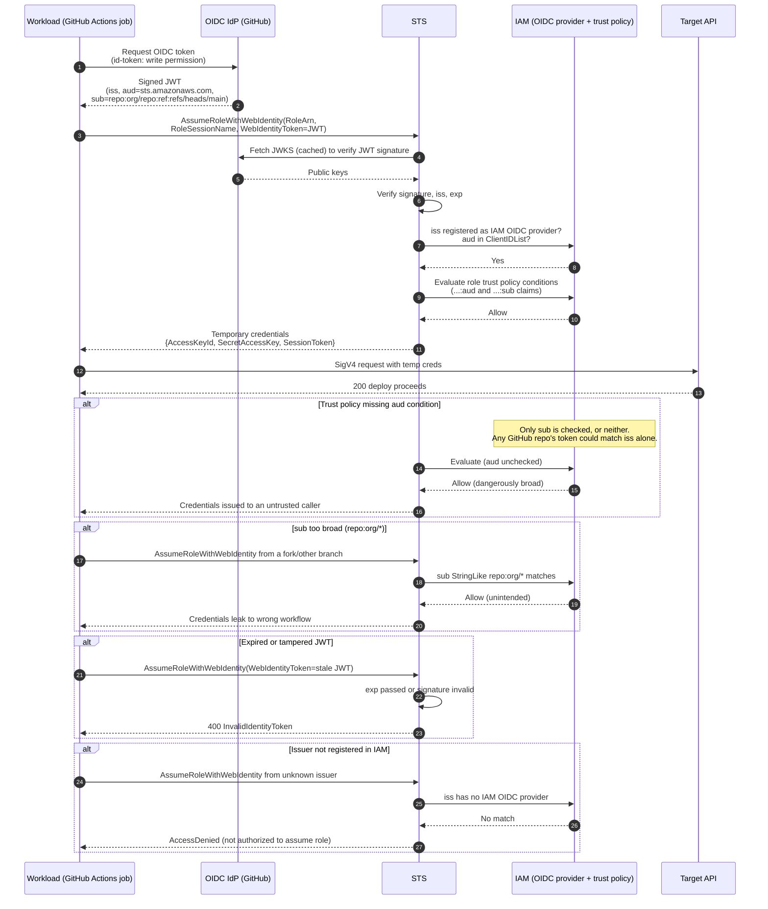

# AssumeRoleWithWebIdentity — Sequence Diagram

Happy path first: a GitHub Actions job mints an OIDC token and exchanges it for AWS
credentials. Then alternates: missing `aud` condition, over-broad `sub`, expired token,
and an unregistered issuer.

Notes

- The `AssumeRoleWithWebIdentity` call itself is **unsigned**; the JWT is the sole proof of
  identity, so trust-policy claim conditions are the security boundary.
- For GitHub, `aud` defaults to `sts.amazonaws.com` when using
  `aws-actions/configure-aws-credentials`; pin it with `StringEquals`.
- The "missing aud" and "broad sub" alternates are shown as they actually behave —
  succeeding — precisely because they are the dangerous misconfigurations to avoid.
