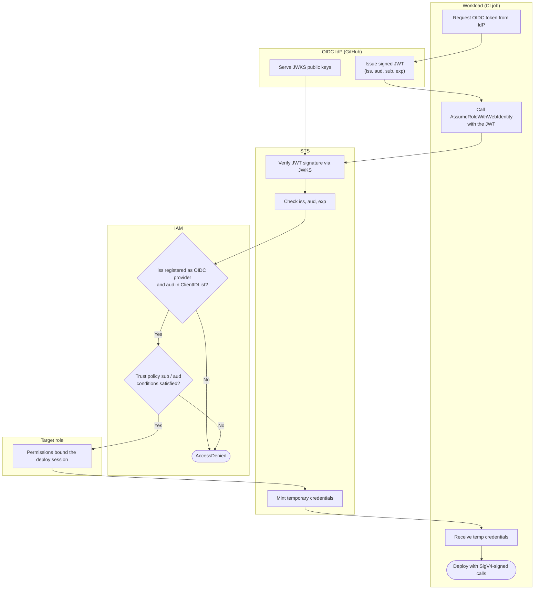

# AssumeRoleWithWebIdentity — Swimlane Diagram

One lane per actor. The JWT crosses from the IdP through the workload to STS; STS pulls
JWKS back from the IdP to verify it.

Notes

- `M1` is the provider-registration and `aud` gate; `M2` is the fine-grained `sub`/`aud`
  claim gate. Both live in the AWS account IAM lane.
- The workload never holds a long-lived AWS key — the only secret is the short-lived JWT,
  which it did not store either.
- Scoping `sub` tightly at `M2` is what stops other repos, branches, or forks from
  assuming the same role.
