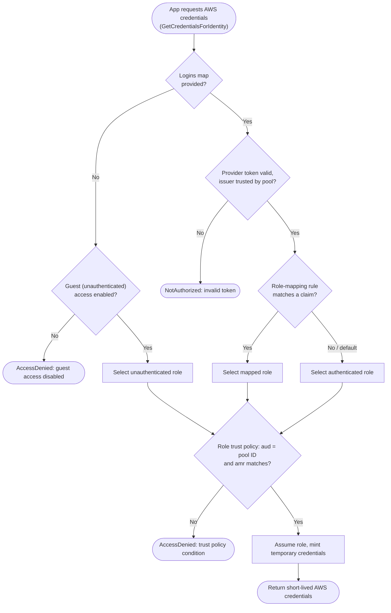

# Cognito Identity Pool — Decision Flowchart

Role selection from an incoming request to issued AWS credentials, with deny terminals.

Notes

- The first decision is authenticated vs guest; guest requires the pool to have
  unauthenticated access enabled and a scoped unauthenticated role.
- The trust-policy `aud`/`amr` gate is what stops another pool's tokens, or a guest, from
  assuming the authenticated role.
- Use `${cognito-identity.amazonaws.com:sub}` in the role policy to isolate each identity's
  resources.
