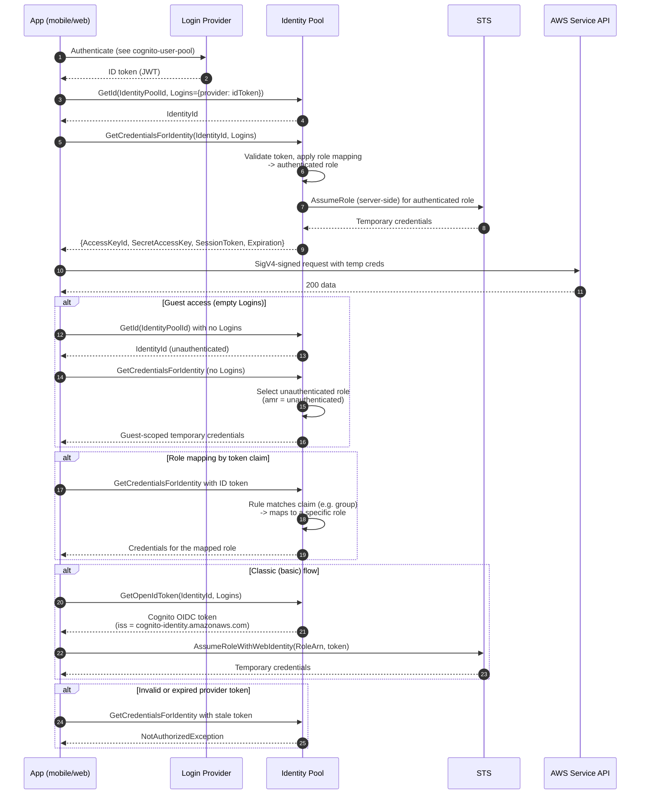

# Cognito Identity Pool — Sequence Diagram

Happy path first: enhanced flow exchanging a user-pool ID token for AWS credentials.
Alternates: guest (unauthenticated) access, role-mapping by claim, the classic
web-identity flow, and an invalid token.

Notes

- Enhanced flow (default) hides the STS call: Cognito assumes the role server-side using the
  pool's role-mapping config and returns credentials directly.
- Classic flow exposes `AssumeRoleWithWebIdentity` — see
  [AssumeRoleWithWebIdentity](../assumerole-web-identity-oidc/README.md).
- The `Logins` map keys the token to a provider; an empty map requests the guest role,
  which must be tightly scoped.
