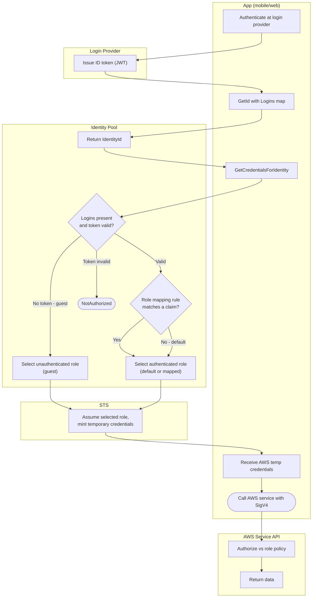

# Cognito Identity Pool — Swimlane Diagram

One lane per actor. The identity pool turns a provider token into AWS credentials, choosing
the authenticated or unauthenticated role.

Notes

- The enhanced flow performs the `T1` assume inside Cognito; the classic flow moves it into
  the App lane via `AssumeRoleWithWebIdentity`.
- Guest access (`N5`) is reachable with no login token, so its role must be minimal or
  disabled.
- Role trust policies gate on `cognito-identity.amazonaws.com:aud` (pool ID) and `amr`
  (authenticated vs unauthenticated) — see [flowchart.md](flowchart.md).
