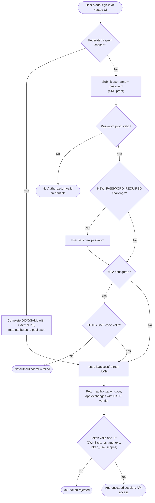

# Cognito User Pool Sign-In — Decision Flowchart

Authentication and challenge branching from sign-in to issued tokens, with error
terminals.

Notes

- The PKCE verifier check happens at the token endpoint; the API-side gate re-verifies the
  token independently via JWKS.
- Federation short-circuits the password step but still routes through pool token issuance.
- `token_use` must match the context — `id` for identity, `access` for API authorization.
