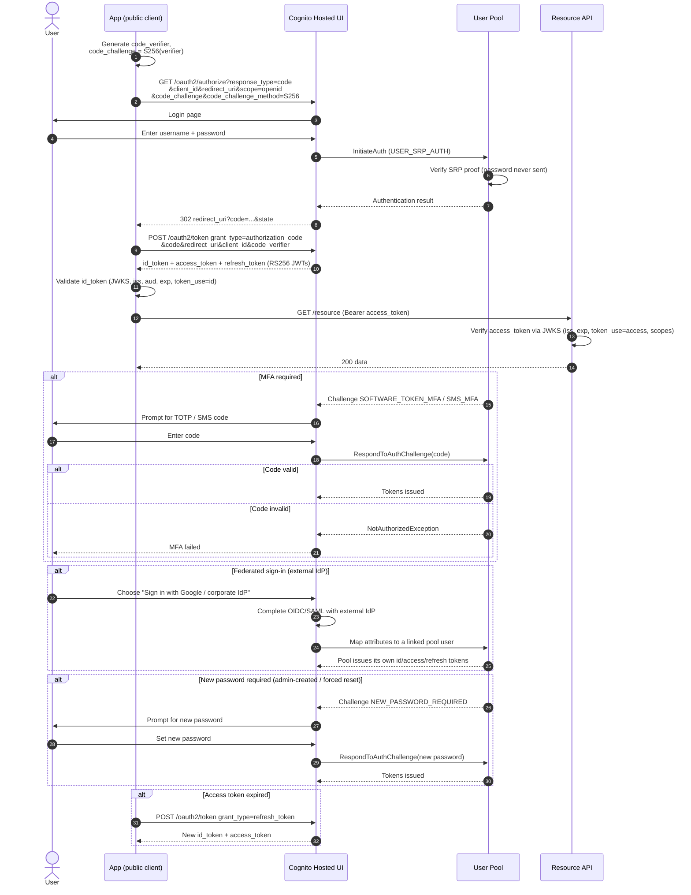

# Cognito User Pool Sign-In — Sequence Diagram

Happy path first: Hosted UI Authorization Code + PKCE producing pool JWTs, then API use.
Alternates: MFA challenge, external-IdP federation, new-password challenge, and refresh.

Notes

- The Hosted UI exchange is exactly the OIDC
  [Authorization Code + PKCE](../../../oidc/authorization-code-pkce/README.md) flow; Cognito
  is the OpenID Provider.
- `USER_SRP_AUTH` proves the password without transmitting it; MFA is a follow-on challenge
  via `RespondToAuthChallenge`.
- These tokens authenticate the user to the app/API only. For AWS IAM credentials, exchange
  the ID token at a [Cognito identity pool](../cognito-identity-pool/README.md).
