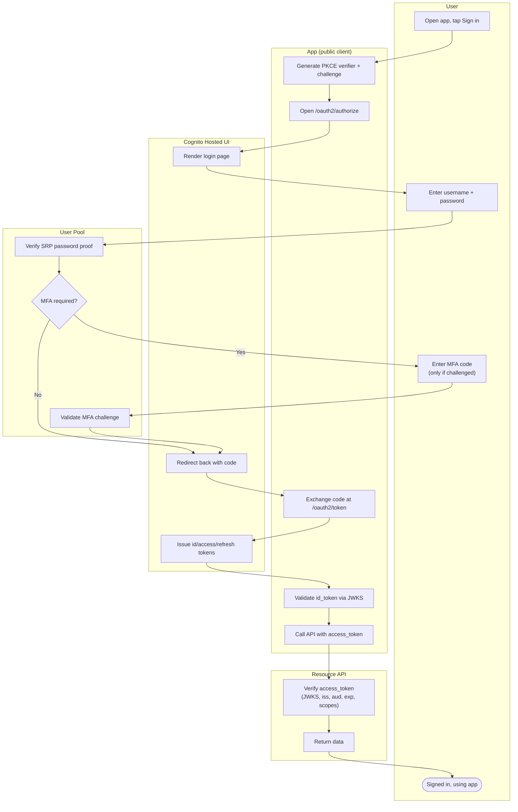

# Cognito User Pool Sign-In — Swimlane Diagram

One lane per actor. The Hosted UI fronts the user pool's OAuth2 endpoints; the app
exchanges the code for pool JWTs and calls the API.

Notes

- The Hosted UI lane is Cognito's OAuth2 surface; the user pool lane holds the actual
  credential and MFA verification.
- Federation replaces the `P1` password step with an external-IdP exchange, but the pool
  still mints its own tokens at `H3` — see [sequence.md](sequence.md).
- Turning these tokens into AWS credentials happens in a separate
  [identity pool](../cognito-identity-pool/README.md) exchange.
