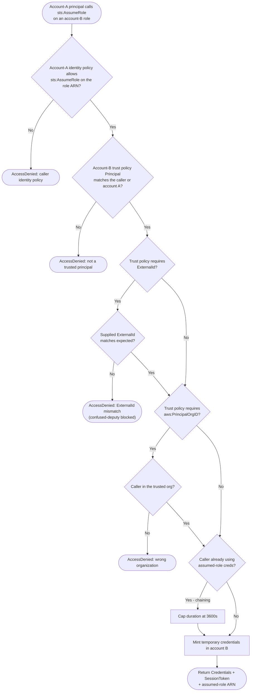

# Cross-Account Role Assumption — Decision Flowchart

Every gate applied to a cross-account `AssumeRole`, with explicit deny terminals.

Notes

- The identity-policy gate is account A, every other gate is account B — a leak on either side
  breaks cross-account isolation.
- `ExternalId` and `aws:PrincipalOrgID`, when present, are hard gates, not advisory.
- Chaining across a further account re-evaluates trust at each hop and never exceeds 1 hour.
