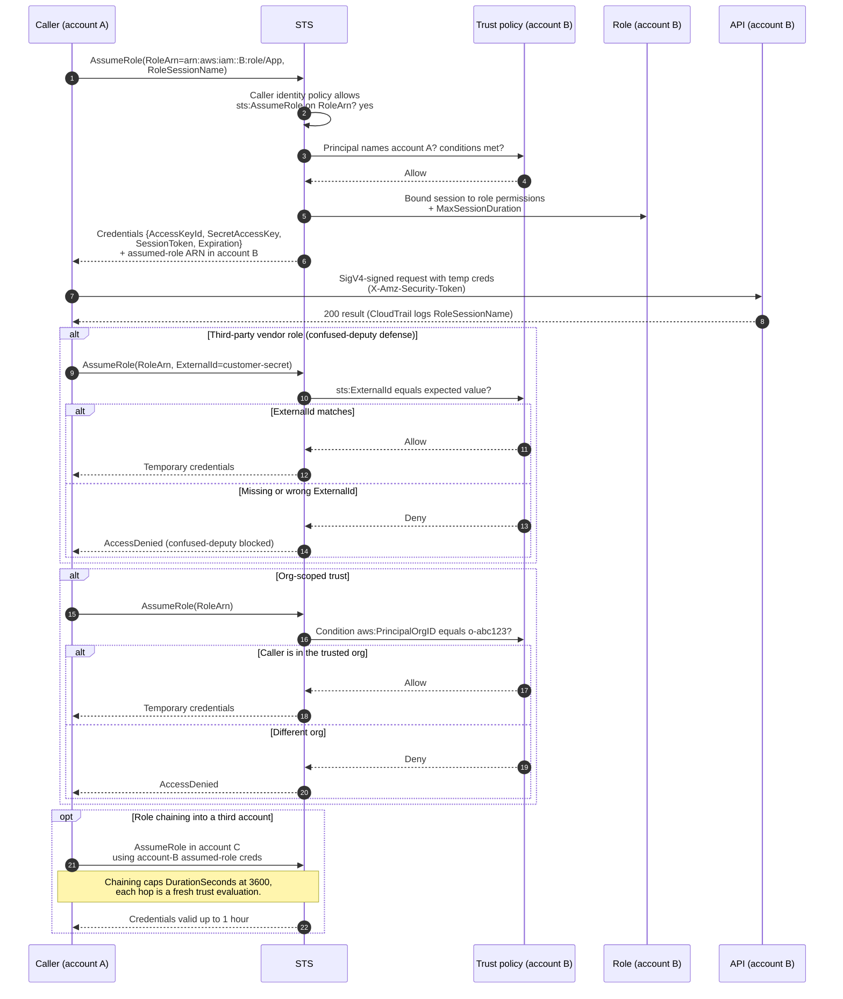

# Cross-Account Role Assumption — Sequence Diagram

Happy path first (a principal in account A assumes a role in account B and calls an account-B
API), then alternates: third-party `ExternalId`, org-scoped trust, and role chaining.

Notes

- Naming account A as `:root` in the trust policy delegates the account-B gate to account A's
  own IAM, the caller still needs the `sts:AssumeRole` identity policy.
- `ExternalId` defeats the confused deputy, it is set by the resource owner and unique per
  customer, never guessable or shared.
- CloudTrail in account B records `RoleSessionName` and the source account for the audit trail.
