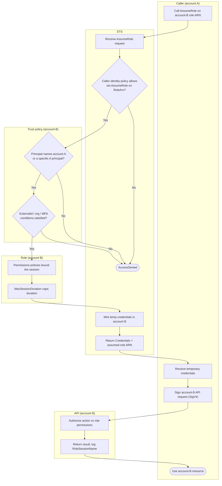

# Cross-Account Role Assumption — Swimlane Diagram

One lane per actor. The caller-side gate is in the STS lane, the resource-side gate is in the
account-B trust-policy lane.

Notes

- `T2` is the account-A side, `B1`/`B2` are the account-B side — both must allow the hop.
- `B2` holds the `ExternalId` (confused-deputy) and `aws:PrincipalOrgID` conditions.
- See [flowchart.md](flowchart.md) for the full deny-terminal decision tree.
