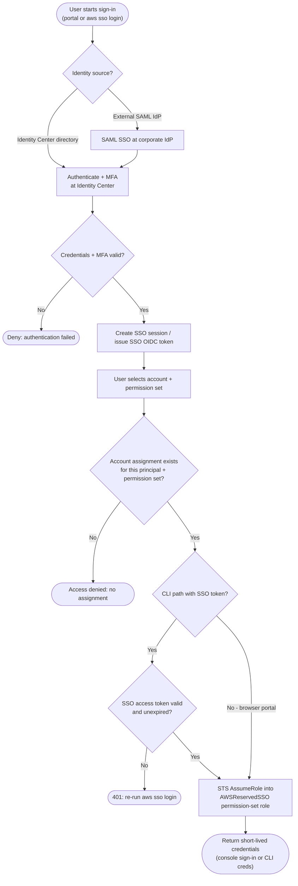

# IAM Identity Center SSO — Decision Flowchart

Authentication, assignment, and token gates from portal/CLI sign-in to credentials.

Notes

- The identity source only changes the authentication step; assignment and STS assume are
  identical for directory and external-IdP sources.
- Account assignment is the core authorization gate — no assignment, no role, regardless of
  successful authentication.
- The CLI branch adds an SSO-token validity gate; expiry sends the user back through
  `aws sso login`.
