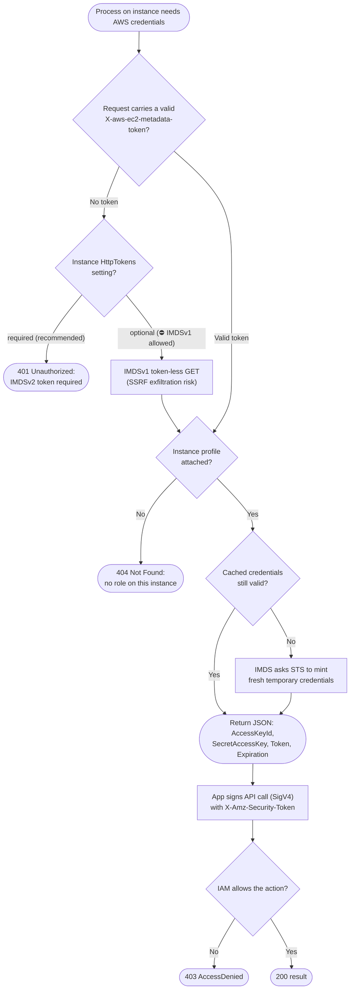

# IMDSv2 Instance Credentials — Decision Flowchart

The version/token gates IMDS applies, with explicit deny and 404 terminals. The IMDSv1 branch is
kept only to show the deprecated SSRF-exposed path.

Notes

- The left branch is the whole point of IMDSv2: with `HttpTokens=required`, a token-less SSRF
  attempt dead-ends at `401` instead of leaking credentials.
- `HttpPutResponseHopLimit=1` means even a valid token cannot be relayed to a container or peer.
- Refreshing (`Refresh`) is automatic and transparent, the SDK renews before `Expiration`.
