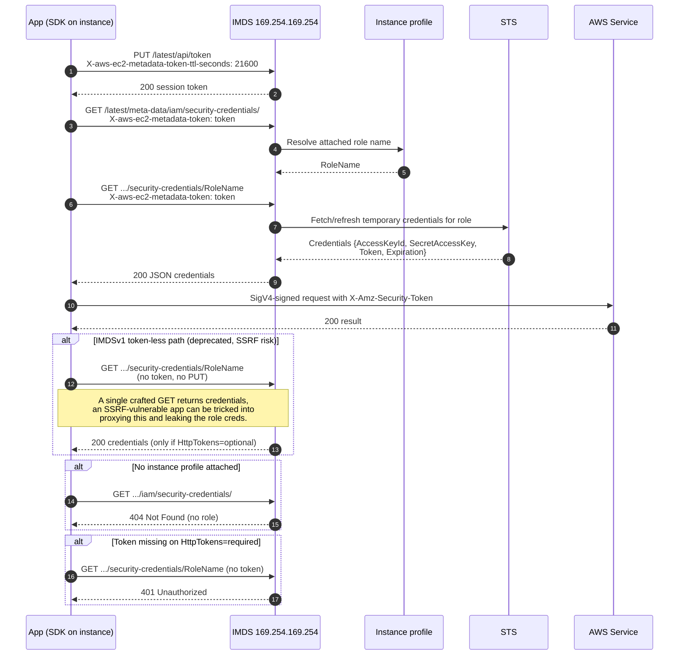

# IMDSv2 Instance Credentials — Sequence Diagram

Happy path first (PUT a session token, GET the credentials, then sign an API call), then
alternates: the deprecated IMDSv1 token-less path abused by SSRF, no profile attached, and a
missing token on a `required` instance.

Notes

- The `PUT`-first requirement plus hop limit 1 is what blocks SSRF, attackers rarely control a
  `PUT` with a custom header and the token cannot cross a proxy or container hop.
- Credentials rotate automatically, the SDK refreshes a few minutes before `Expiration`.
- With `HttpTokens=required` the IMDSv1 alternate returns 401, close IMDSv1 everywhere.
