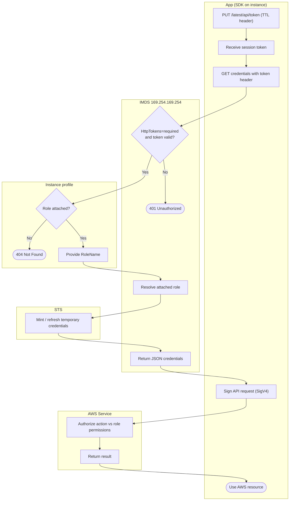

# IMDSv2 Instance Credentials — Swimlane Diagram

One lane per actor. The token handshake and credential fetch span the App and IMDS lanes; the
minting lives in the STS lane.

Notes

- `D1` enforces IMDSv2, a token-less `GET` fails here when `HttpTokens=required`.
- `F1` is the 404 branch when no instance profile is attached.
- `HttpPutResponseHopLimit=1` keeps the token in the App lane, it cannot be relayed off-host.
