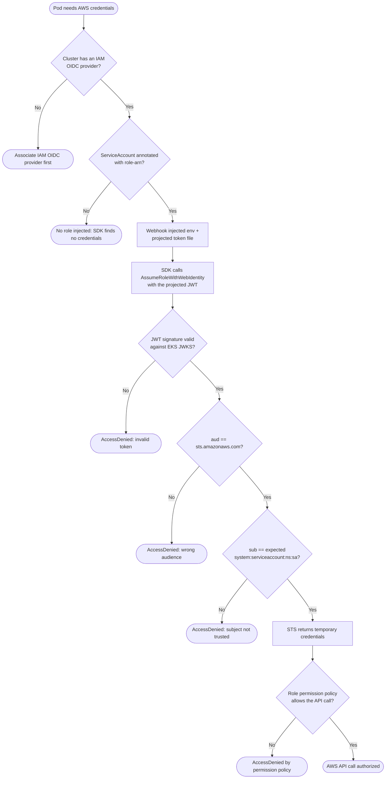

# IRSA on EKS — Decision Flowchart

Every gate between a pod and temporary AWS credentials, with explicit denial terminals.

Notes

- Pinning only `aud` and not `sub` is the classic IRSA misconfiguration: it lets any
  ServiceAccount in the cluster assume the role.
- The permission-policy gate is separate from trust: trust decides *who* may assume the role,
  the permission policy decides *what* the role can do.
