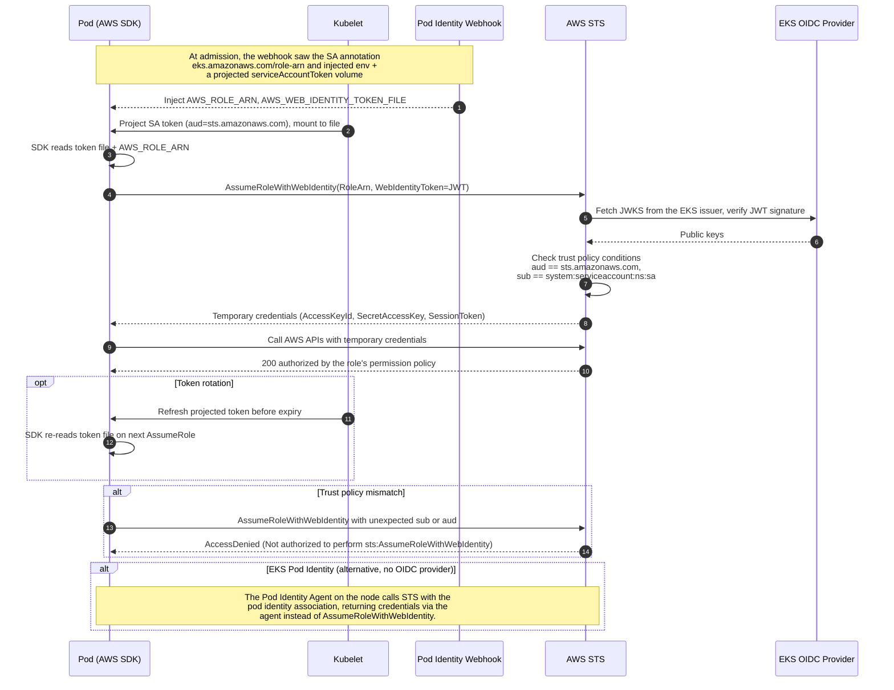

# IRSA on EKS — Sequence Diagram

Happy path first (pod assumes its role via a projected OIDC token), then token rotation,
trust-policy mismatch, and the EKS Pod Identity alternative.

Notes

- The projected token is a short-lived, audience-bound JWT signed by the cluster's OIDC issuer;
  the SDK re-reads it from `AWS_WEB_IDENTITY_TOKEN_FILE` on each assume.
- No static access keys exist anywhere in this flow.
