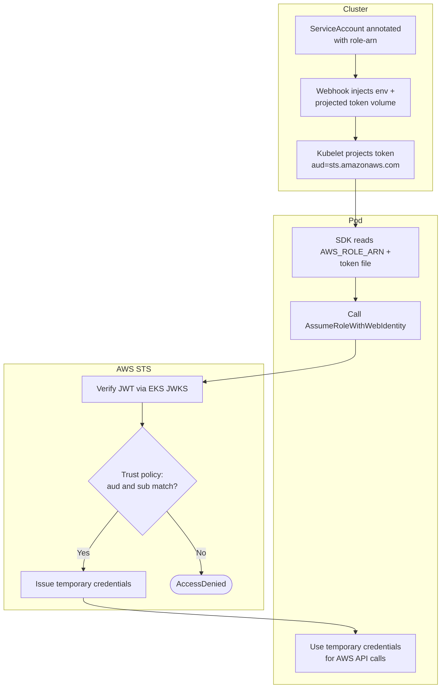

# IRSA on EKS — Swimlane Diagram

One lane per actor. The projected token crosses from the cluster into AWS STS.

Notes

- The trust-policy check `S2` is the security boundary: it must pin the exact
  `system:serviceaccount:<ns>:<sa>` subject, not just the audience.
