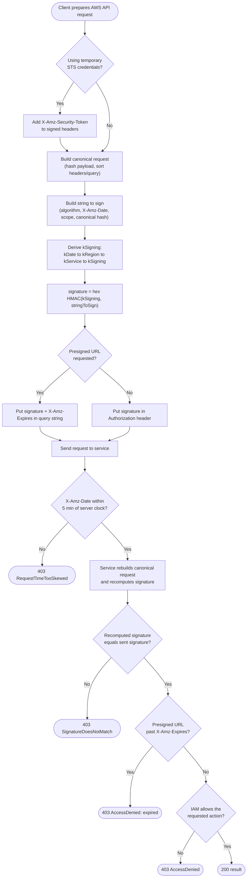

# SigV4 Request Signing — Decision Flowchart

The signing pipeline and every verification gate the service applies, with explicit error
terminals.

Notes

- A mismatch at `Match` most often means bad canonicalization (unsorted headers, unencoded path)
  or the wrong region/service in the scope.
- Skew (`Skew`) is checked before signature comparison, so a correct signature on a stale clock
  still fails.
- For presigned URLs, `X-Amz-Expires` is the only time bound — there is no separate revocation.
