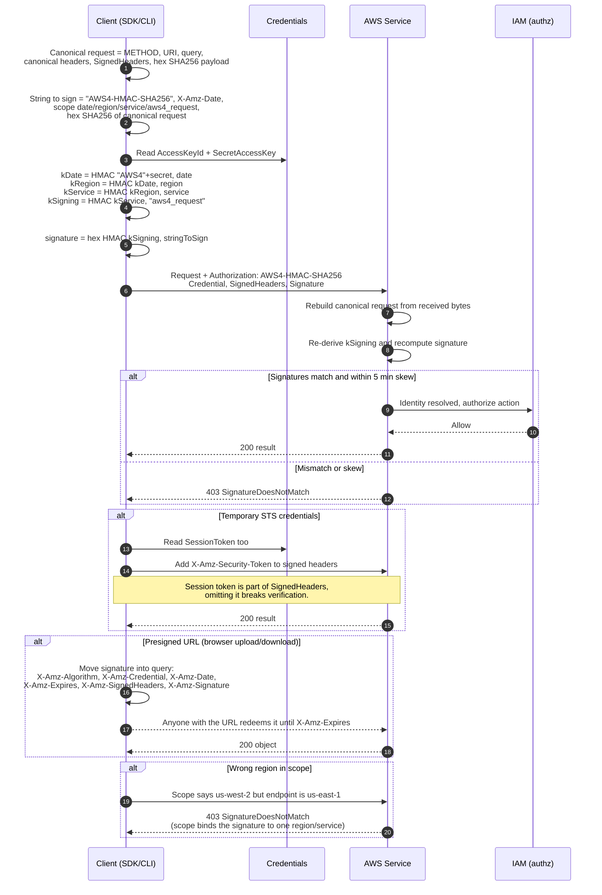

# SigV4 Request Signing — Sequence Diagram

Happy path first (build canonical request, derive the key chain, sign, and let the service
verify), then alternates: temporary credentials, presigned URL, and a signature mismatch.

Notes

- The service never receives the secret key, it re-derives `kSigning` from its own stored copy.
- Scope (`date/region/service/aws4_request`) is what makes a captured signature non-portable.
- `X-Amz-Content-Sha256` is mandatory for S3, `UNSIGNED-PAYLOAD` is allowed only over HTTPS.
