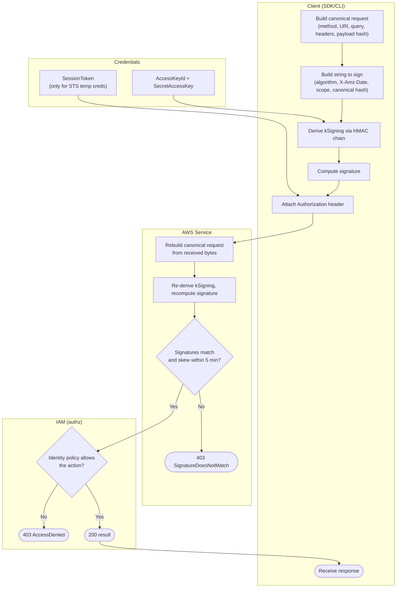

# SigV4 Request Signing — Swimlane Diagram

One lane per actor. The signing pipeline lives in the Client lane; verification lives in the
Service lane; the final allow/deny is in the IAM lane.

Notes

- `Creds` feeds the secret into the HMAC chain (`C3`) and, for temp credentials, the session
  token into the signed request (`C5`).
- Verification (`S3`) is authentication, the IAM check (`M1`) is authorization — both must pass.
- A wrong region or service in the scope changes `kSigning`, so `S3` fails before IAM is reached.
