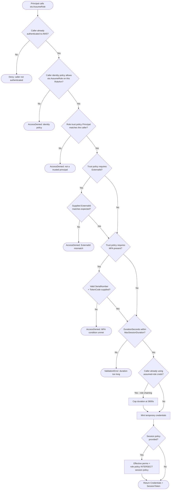

# STS AssumeRole — Decision Flowchart

Every gate STS and IAM apply to an `AssumeRole` call, with explicit deny terminals.

Notes

- The identity-policy gate is the account-A side; the trust-policy gate is the account-B
  side. In single-account use both live in the same account.
- `ExternalId` and MFA are optional conditions but, when present in the trust policy, are
  hard gates.
- A session policy at `Mint` can only intersect (shrink) permissions; it never expands
  beyond the role's own permissions policies.
