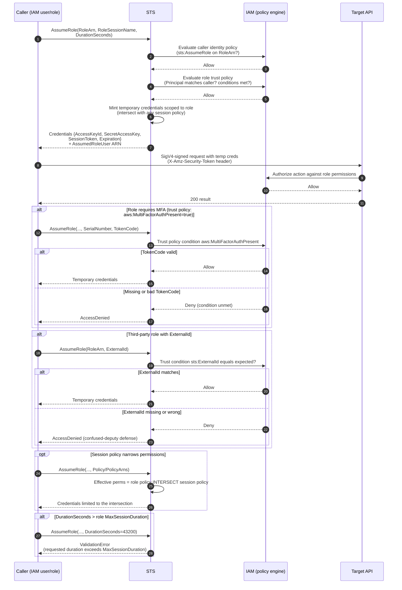

# STS AssumeRole — Sequence Diagram

Happy path first (a caller assumes a role and calls an API with the temporary
credentials), then alternates: MFA-required role, `ExternalId` mismatch, session-policy
narrowing, and a duration that exceeds `MaxSessionDuration`.

Notes

- Both gates (steps 2-3 and 4-5) must return Allow; either deny fails the whole call.
- The temporary credentials carry a `SessionToken` sent as `X-Amz-Security-Token`; without
  it SigV4 verification fails for temporary credentials.
- Role chaining (assuming a role using already-assumed-role credentials) silently caps
  `DurationSeconds` at 3600.
