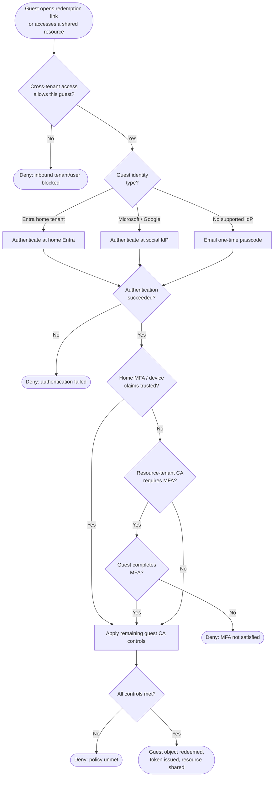

# B2B Guest Invitation and Redemption — Decision Flowchart

Selecting the redemption path and passing cross-tenant + Conditional Access gates. Deny
paths terminate explicitly.

Notes

- The cross-tenant access gate runs first — an inbound block stops redemption regardless of
  the guest's ability to authenticate.
- Trusting the home tenant's MFA avoids re-challenging the guest; otherwise resource-tenant
  Conditional Access enforces its own MFA.
- Authorization to the specific resource is always the resource tenant's decision, even
  though authentication happened at the guest's home IdP.
