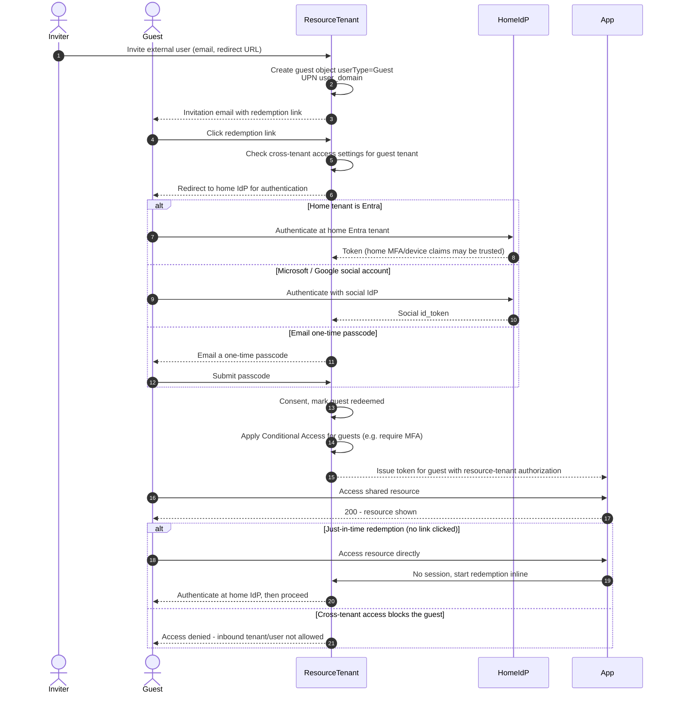

# B2B Guest Invitation and Redemption — Sequence Diagram

Happy path first (invite, redeem via home Entra tenant, access app), then social-account,
email-OTP, JIT redemption, and cross-tenant block alternates.

Notes

- Authentication happens at the guest's home IdP, authorization and Conditional Access are
  enforced by the resource tenant.
- If cross-tenant settings trust the home tenant's MFA, the guest is not re-challenged,
  otherwise the resource tenant's CA demands its own MFA.
- The `#EXT#` UPN and the guest object let the resource tenant manage lifecycle
  independently of the guest's home account.
