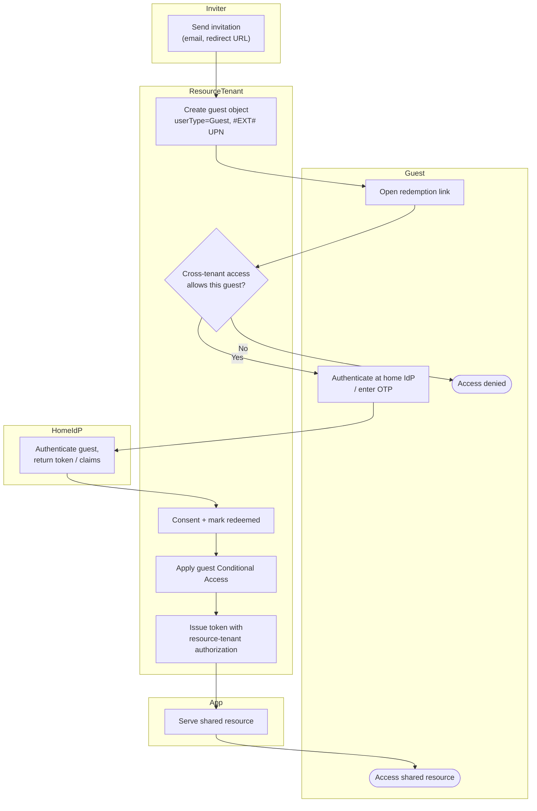

# B2B Guest Invitation and Redemption — Swimlane

One lane per actor. Authentication crosses into the Home IdP lane; authorization stays in
the Resource Tenant lane.

Notes

- `R2` is the cross-tenant access gate — inbound tenant/user allow-lists and MFA/device
  trust decisions live here.
- The Home IdP lane authenticates the guest; the Resource Tenant lane owns the guest object,
  Conditional Access, and the final authorization.
