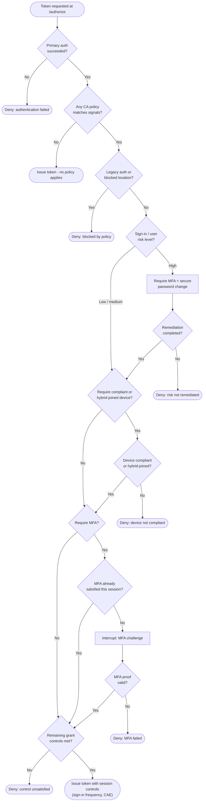

# Conditional Access Evaluation — Decision Flowchart

Signal-by-signal evaluation. Block and deny paths terminate explicitly; remediable
controls loop back through an interrupt.

Notes

- Block controls are evaluated first and short-circuit everything else — a matched block
  policy always wins over any grant.
- The MFA "already satisfied" gate reflects the `amr` / `satisfied_by` claims so a live
  session is not re-challenged needlessly.
- Session controls (sign-in frequency, persistent browser, CAE) are stamped onto the
  token at the final issue step; CAE lets those tokens be revoked mid-session.
