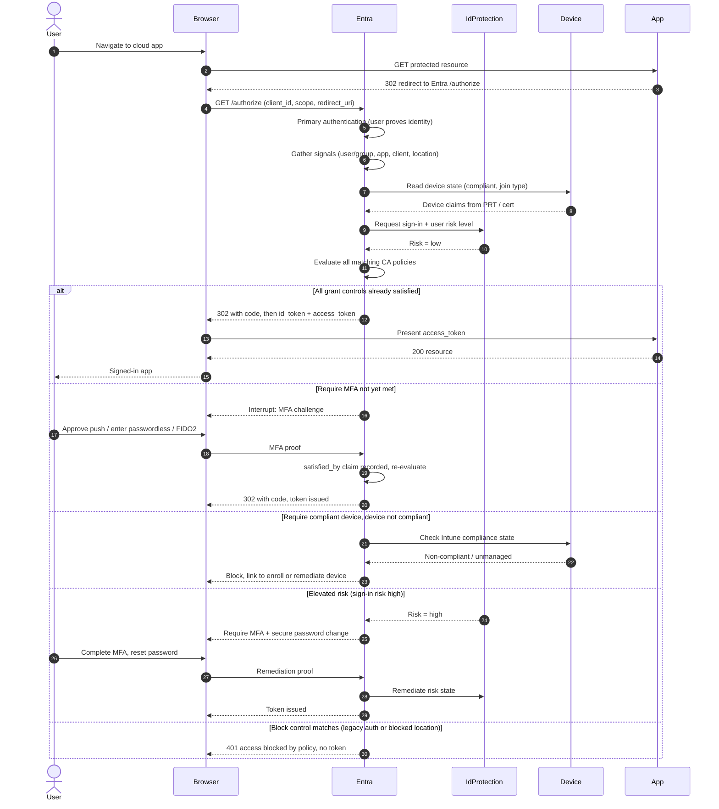

# Conditional Access Evaluation — Sequence Diagram

Happy path first (policy satisfied, token issued), then alternates: MFA interrupt,
non-compliant device block, risk-based step-up, and a hard block control.

Notes

- Signals are gathered before grant controls are evaluated, commas separate list items in
  these notes to keep the diagram parseable.
- The `satisfied_by` / `amr` claims record which controls were met so the same session
  does not re-prompt unnecessarily.
- Session controls (sign-in frequency, CAE) are attached to the issued token, not shown
  as interrupts here.
