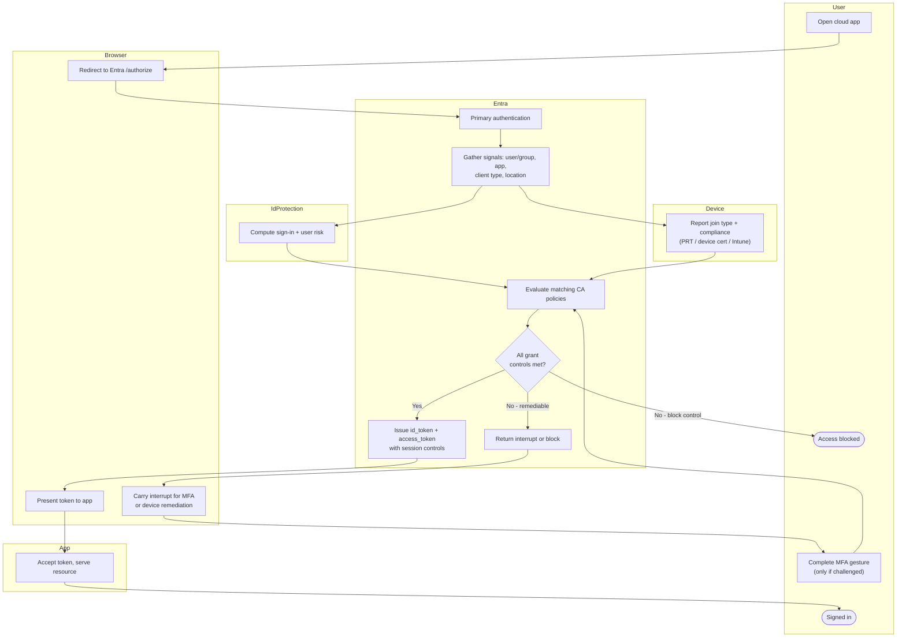

# Conditional Access Evaluation — Swimlane

One lane per actor. The Entra lane hosts the policy engine; interrupts cross back to the
User/Browser lanes.

Notes

- Risk (Identity Protection) and device state (Intune / registration) feed the engine as
  parallel signals before policy evaluation.
- The `E4 --> E6 --> ... --> E3` loop is the interrupt-and-re-evaluate cycle for MFA and
  device remediation; a block control skips straight to the deny terminal.
