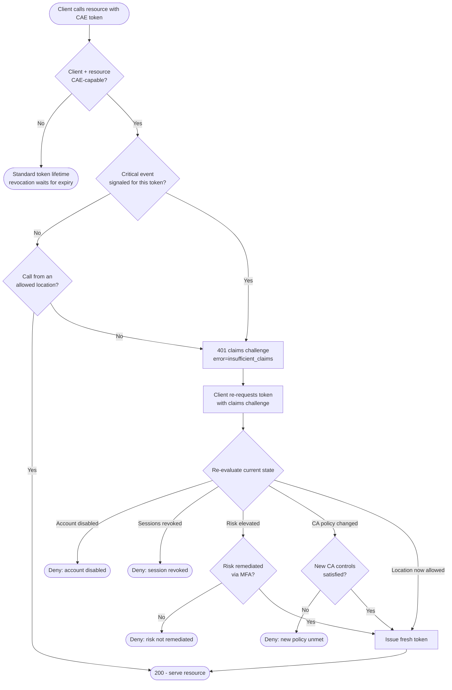

# Continuous Access Evaluation — Decision Flowchart

Whether a CAE-capable resource accepts a token or issues a claims challenge, and how
re-evaluation resolves. Deny paths terminate explicitly.

Notes

- Non-CAE-aware clients fall back to standard token expiry — they gain nothing from CAE but
  are not broken by it.
- Every re-evaluation branch is fail-closed: the client only gets a fresh token when the
  current state actually satisfies policy.
- CAE reduces the revocation window from ~1 token lifetime to minutes, which is why CAE
  tokens can safely be long-lived.
