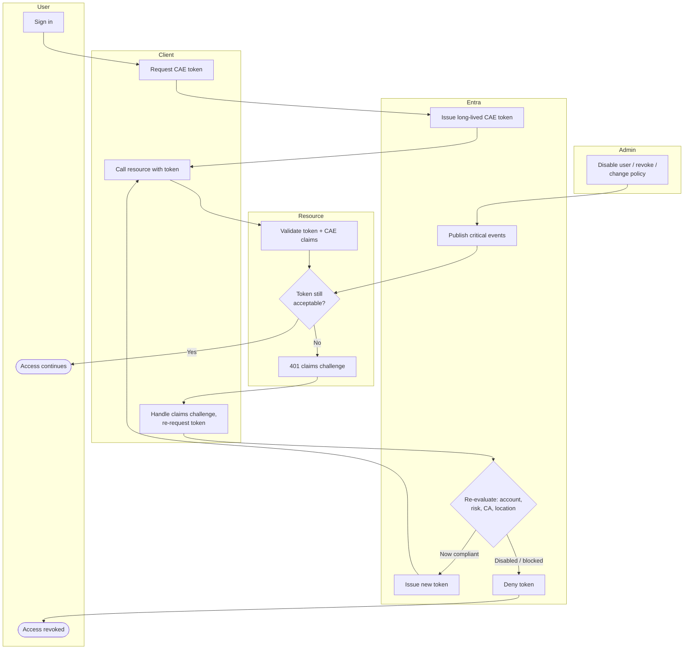

# Continuous Access Evaluation — Swimlane

One lane per actor. The Admin lane triggers the critical events that drive re-evaluation.

Notes

- The `A1 --> E2 --> R2` path is what makes revocation near-real-time: the resource learns
  of the critical event and starts challenging the existing token.
- The claims-challenge loop (`R3 --> C3 --> E3`) forces the client back through Entra so the
  current state is re-evaluated before any new token is issued.
