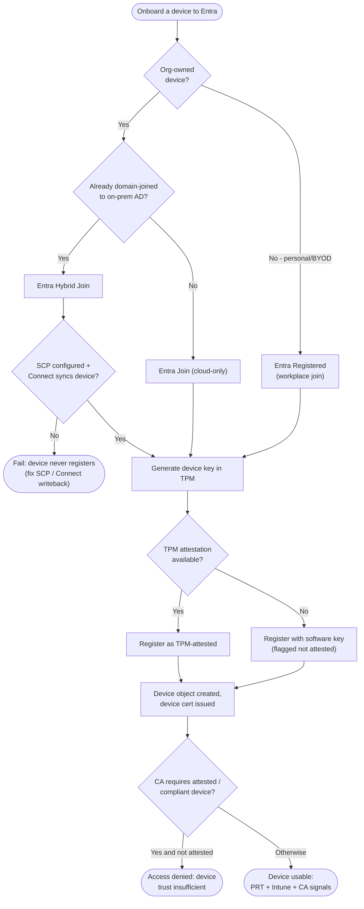

# Device Join and Registration — Decision Flowchart

Choosing the join type and passing the trust gates. Failure paths terminate explicitly.

Notes

- Entra Join is the greenfield default; Hybrid Join exists to preserve on-prem AD and
  Group Policy dependencies during migration.
- A device object is created even without attestation, but stronger CA policies can refuse
  a non-attested / non-compliant device.
- Registered (BYOD) devices satisfy device-based CA without changing the user's primary
  sign-in identity.
