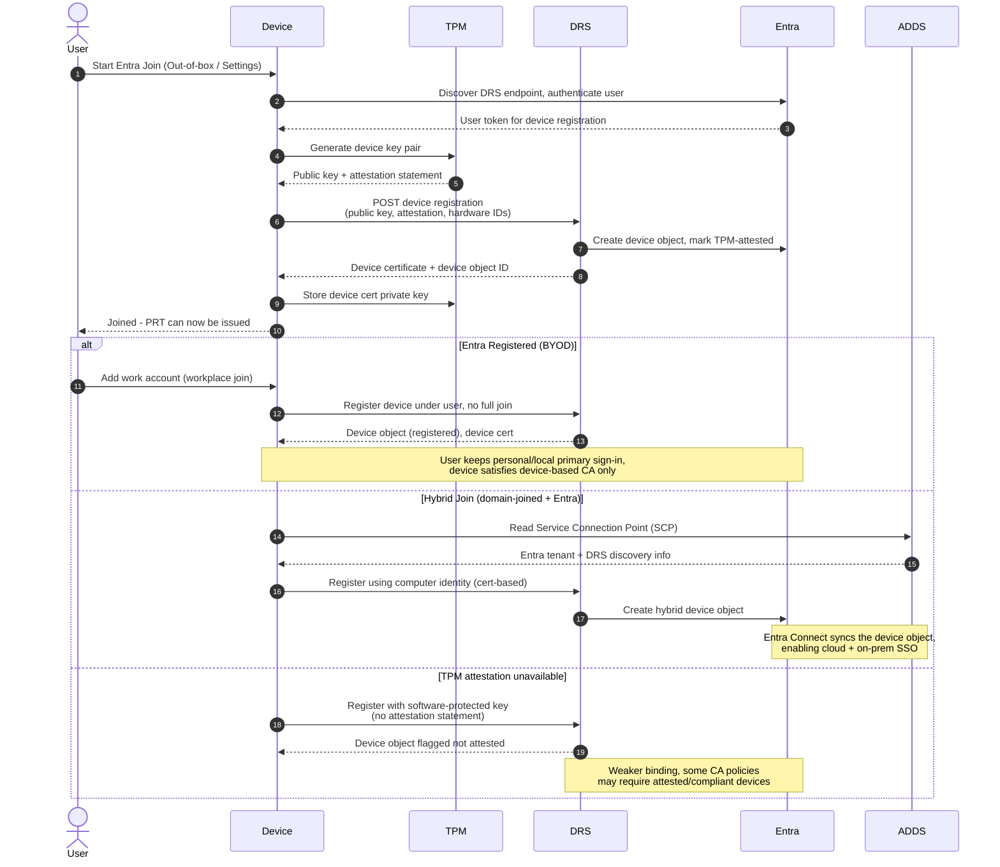

# Device Join and Registration — Sequence Diagram

Happy path first (Entra Join with TPM attestation), then Entra Registered (BYOD), Hybrid
Join via the SCP, and an attestation-unavailable fallback.

Notes

- Attestation lets Entra trust the key is TPM-bound, commas separate the list items in
  these notes so the diagram parses.
- Hybrid Join keys off the on-prem SCP written by Entra Connect, without it, domain
  devices never discover the right tenant.
- After any successful registration the device can obtain a PRT and be targeted by Intune
  compliance policies.
