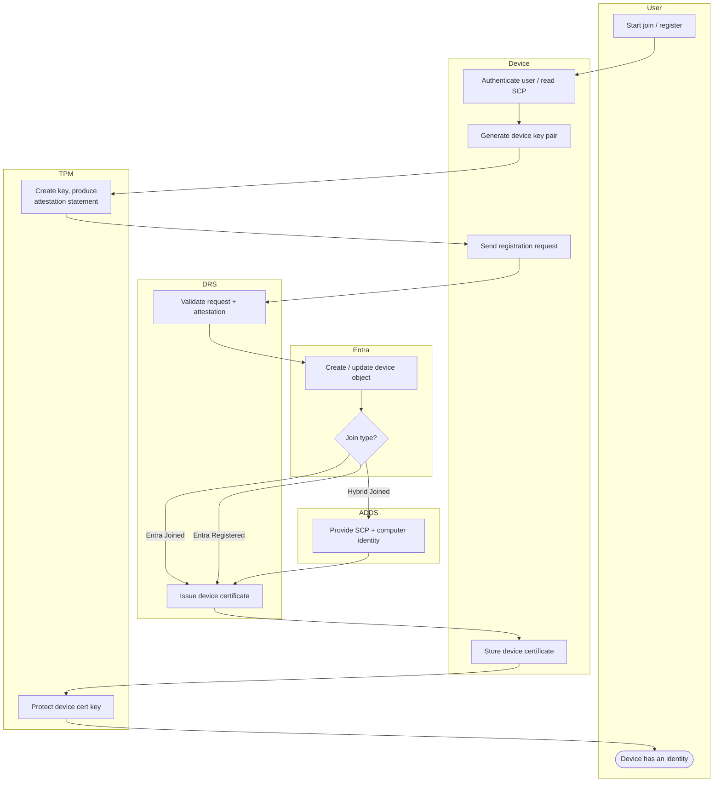

# Device Join and Registration — Swimlane

One lane per component. The on-prem AD lane participates only in the Hybrid Join branch.

Notes

- The `A1` (on-prem AD) node only appears on the Hybrid Join path, supplying the SCP and
  the computer identity used to register.
- Whether the device is flagged TPM-attested depends on `T1` producing a valid attestation
  statement; software-key fallback still creates a device object but marks it not attested.
