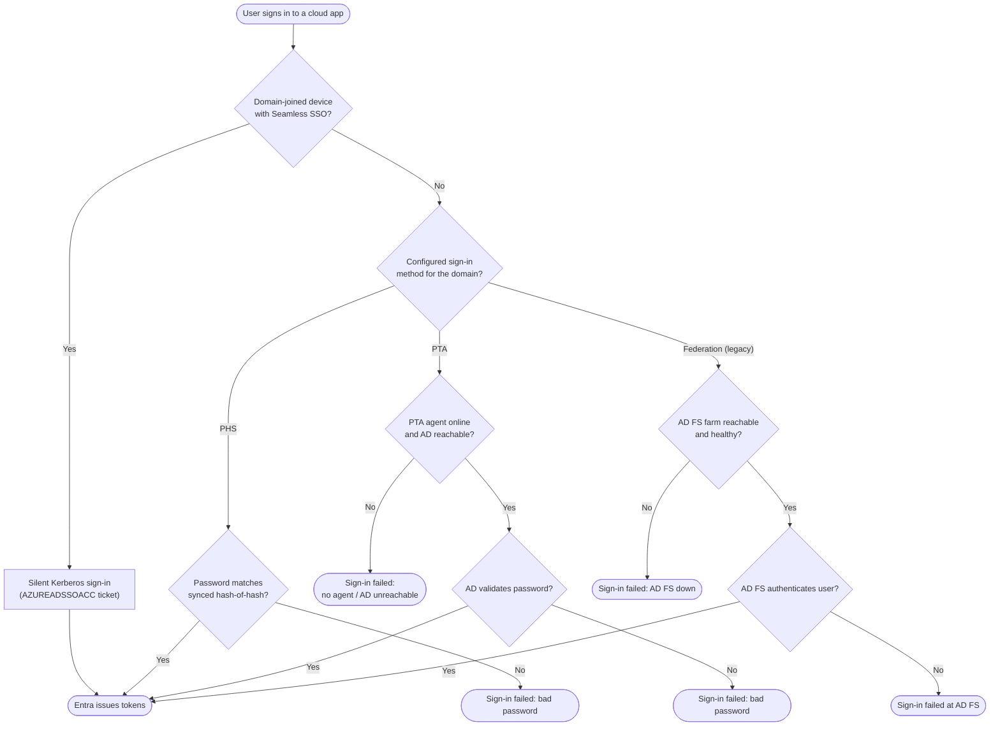

# Hybrid Identity Sync — Decision Flowchart

Choosing and executing a sign-in method, with per-method failure terminals.

Notes

- The PHS branch has no on-prem dependency at sign-in, so it has no reachability terminal — its
  key resilience advantage.
- PTA and Federation each add an availability gate (`Reach`, `Fed`) that PHS avoids.
- Seamless SSO short-circuits the whole method decision on eligible devices.
