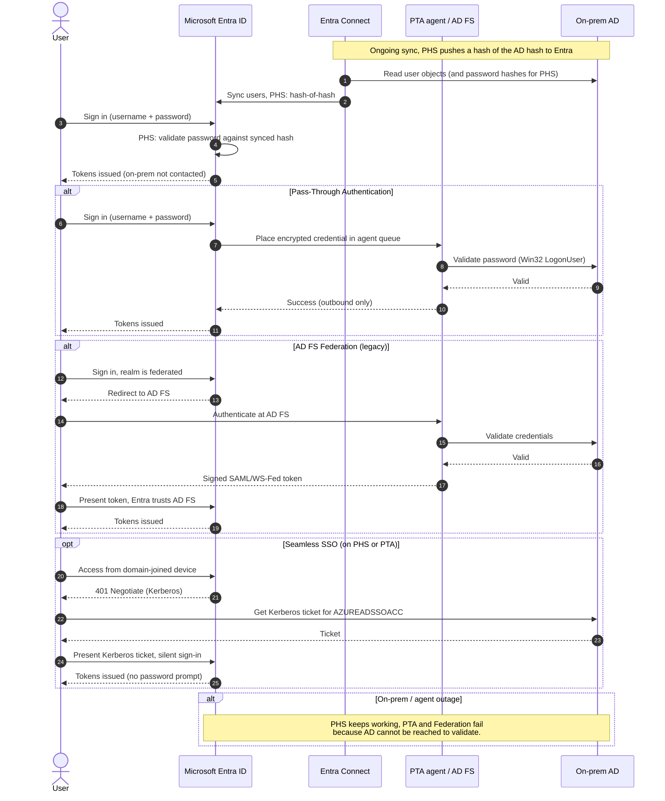

# Hybrid Identity Sync — Sequence Diagram

Happy path first (Password Hash Sync: Entra validates the password itself), then alternates:
Pass-Through Authentication, AD FS Federation (legacy), and Seamless SSO.

Notes

- PHS validates in the cloud, so an on-prem outage does not block sign-in, PTA and Federation both
  depend on on-prem reachability.
- PTA agents connect outbound only and never store password material in the cloud.
- AD FS issues the token itself, token-signing key theft forges any user (Golden SAML), which is
  why it is now discouraged.
