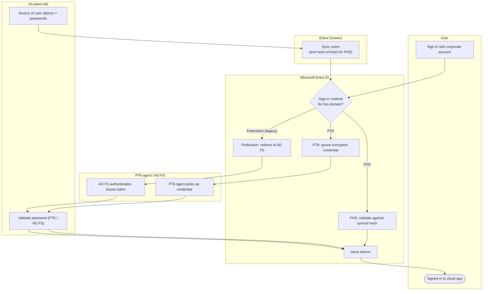

# Hybrid Identity Sync — Swimlane Diagram

One lane per actor. The three sign-in methods diverge at Entra: PHS validates in the Entra lane,
PTA and Federation cross into the Agent and AD lanes.

Notes

- PHS (`E2`) never leaves the Entra lane at sign-in, so an AD outage does not block it.
- PTA and Federation both funnel through `D2` in the AD lane and fail if AD is unreachable.
- Connect (`C1`) runs continuously and is independent of the interactive sign-in path.
