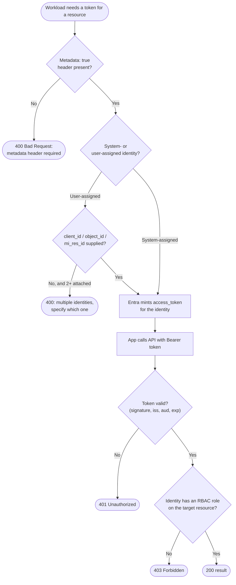

# Managed Identity via IMDS — Decision Flowchart

The identity-selection and validation gates on the token path, with explicit error terminals.

Notes

- The ambiguity terminal (`ErrAmb`) only fires for user-assigned identities when more than one is
  attached and none is named.
- Token validation (`Valid`) is authentication, the RBAC check (`Rbac`) is authorization — both
  must pass.
- A system-assigned identity skips the disambiguation gate entirely.
