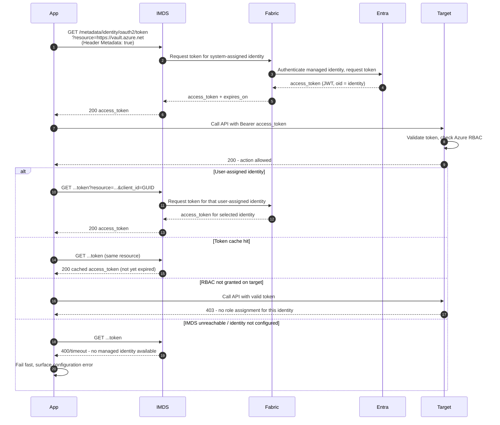

# Managed Identity via IMDS — Sequence Diagram

Happy path first (system-assigned token from IMDS, call target), then user-assigned
selection, cache hit, RBAC denial, and IMDS-unreachable alternates.

Notes

- The token is a normal Entra access token, the difference is only how it is obtained,
  from the local IMDS endpoint with no secret in the app.
- With multiple user-assigned identities attached the caller must pass `client_id` or
  `mi_res_id`, otherwise IMDS cannot decide which to use.
- A successfully issued token can still be refused by the target if the identity lacks the
  right Azure RBAC role assignment.
