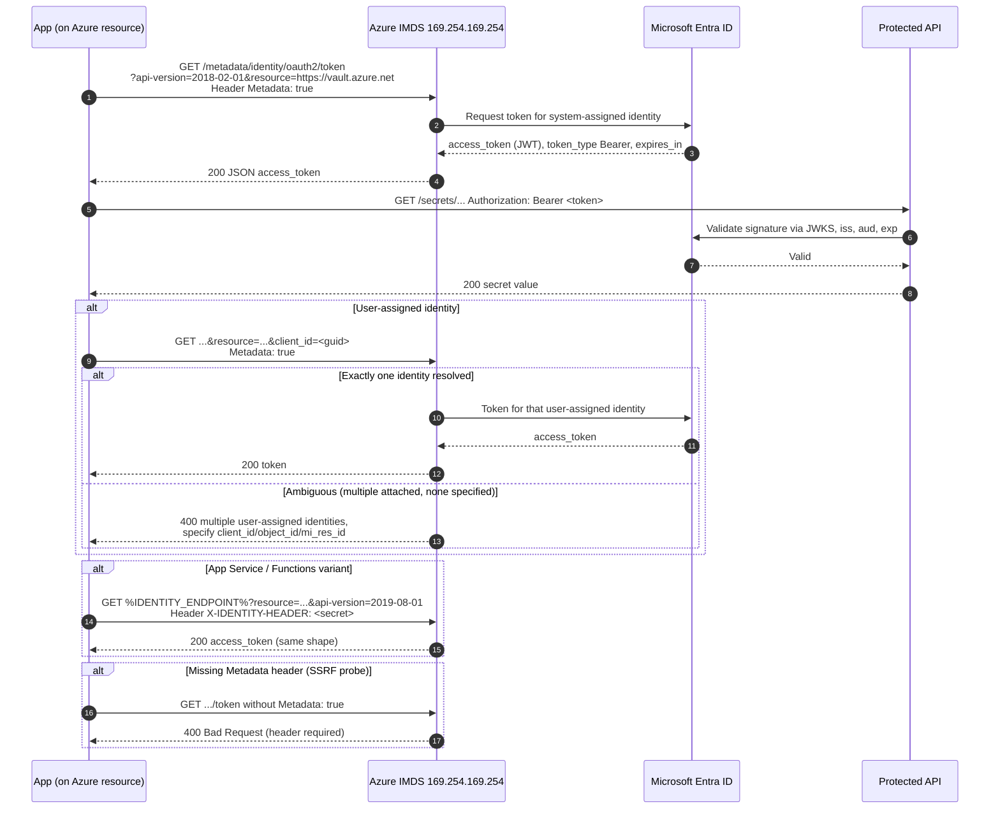

# Managed Identity via IMDS — Sequence Diagram

Happy path first (a VM with a system-assigned identity gets a token and calls Key Vault), then
alternates: user-assigned selection, the App Service variant, and a missing metadata header.

Notes

- System-assigned needs no identity parameter, user-assigned must disambiguate via `client_id`,
  `object_id`, or `mi_res_id`.
- App Service and Functions use `IDENTITY_ENDPOINT` + `X-IDENTITY-HEADER` instead of the
  link-local address, the token shape is identical.
- The `Metadata: true` requirement and `X-Forwarded-For` rejection blunt naive SSRF.
