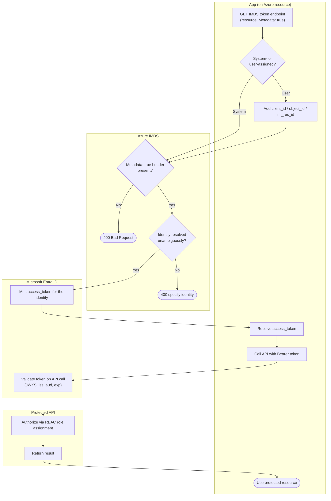

# Managed Identity via IMDS — Swimlane Diagram

One lane per actor. Token acquisition spans the App and IMDS lanes; issuance is in the Entra lane.

Notes

- `D1` is the SSRF guard, `D3` is the user-assigned disambiguation gate.
- The token is a normal Entra access token, the API validates it against Entra's JWKS (`E2`).
- Authorization on the API side (`P1`) is Azure RBAC on the target resource, separate from token
  issuance.
