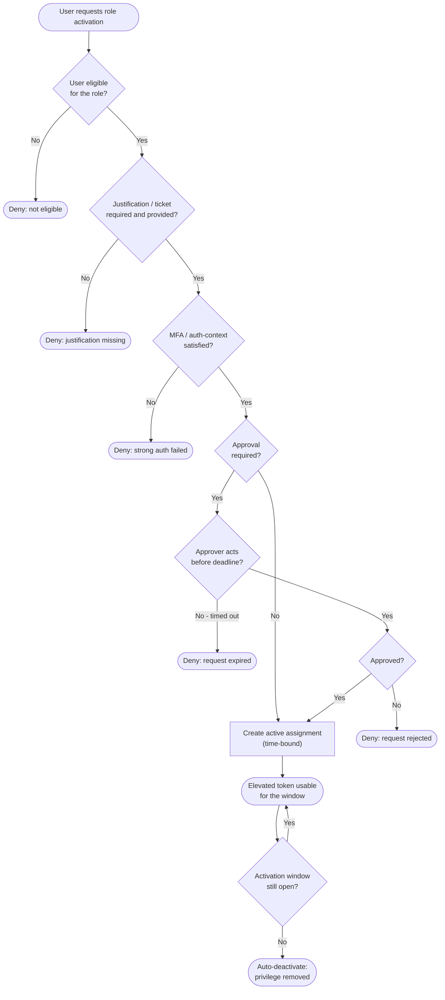

# PIM JIT Elevation — Decision Flowchart

Every activation gate from eligibility to expiry. Deny and expiry paths terminate
explicitly.

Notes

- Each gate is fail-closed: failing eligibility, justification, MFA, or approval yields no
  privilege at all.
- The `Use --> Window` loop represents the bounded active period; expiry triggers automatic
  deactivation, and CAE can cut it short on a critical event.
- Break-glass accounts are deliberately excluded from these gates for emergency access and
  are monitored instead.
