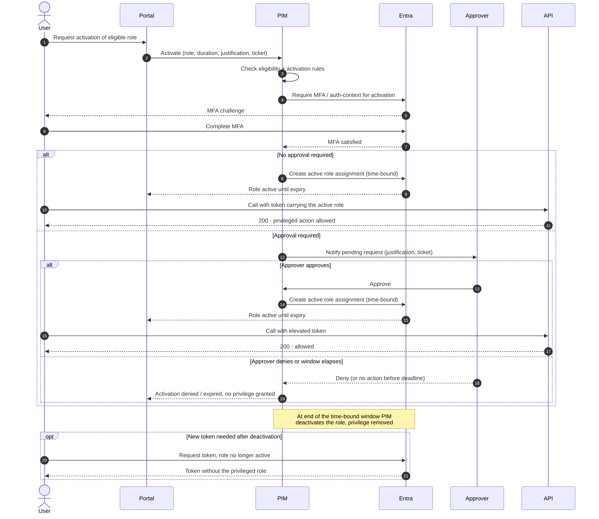

# PIM JIT Elevation — Sequence Diagram

Happy path first (self-activation with MFA + justification), then the approval-required,
denied, and auto-deactivation alternates.

Notes

- Eligibility is necessary but not sufficient, the activation rules (MFA, justification,
  approval) must also pass before any privilege is granted.
- Approval is asynchronous, the request sits pending until an approver acts or the request
  deadline elapses.
- Deactivation is automatic at expiry; with CAE the already-issued elevated token can be
  revoked rather than lingering until it expires.
