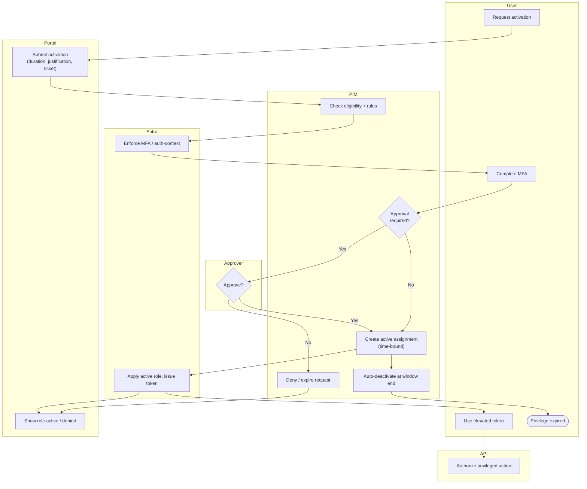

# PIM JIT Elevation — Swimlane

One lane per actor. The Approver lane participates only when the role requires approval.

Notes

- The MFA step (`E1 --> U2`) happens before the approval branch, so approvers only see
  requests from a strongly authenticated principal.
- Auto-deactivation (`P5`) removes privilege at the end of the window with no user action;
  a denied or timed-out request never creates an active assignment.
