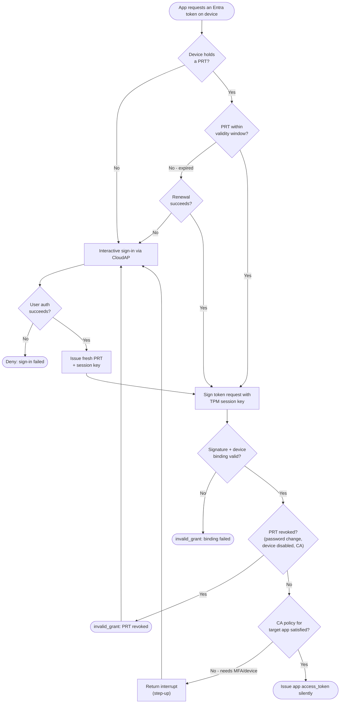

# Primary Refresh Token — Decision Flowchart

Whether the endpoint can serve an app token silently from a PRT, or must fall back to
interactive authentication. Failure paths terminate explicitly.

Notes

- Silent token acquisition is only possible when a valid, bound, unrevoked PRT exists and
  the target app's CA controls are already met.
- Any binding or revocation failure forces a fall-back to interactive sign-in, which
  mints a fresh PRT before retrying.
- The PRT's MFA claim can pre-satisfy an app's MFA grant control, avoiding the step-up
  branch entirely.
