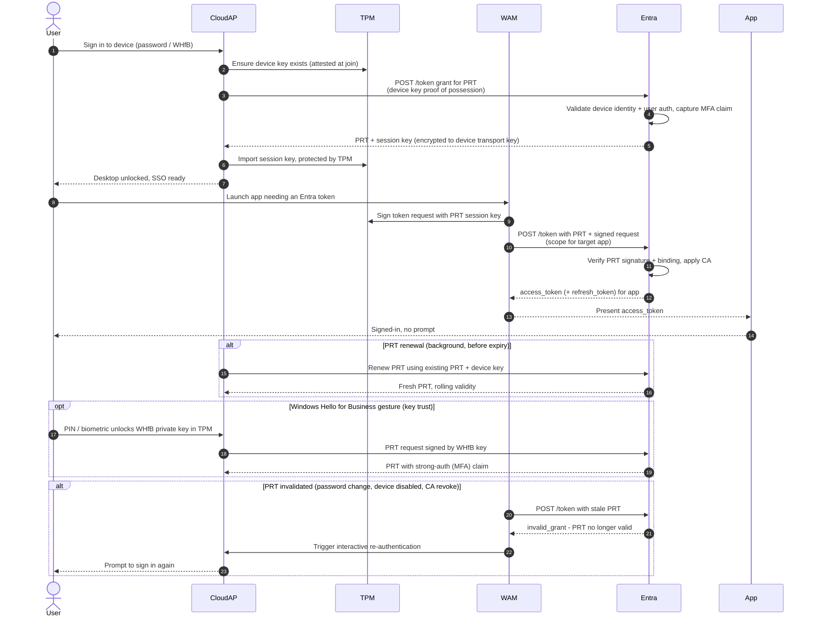

# Primary Refresh Token — Sequence Diagram

Happy path first (interactive logon issues the PRT, then a brokered app token), followed
by renewal, WHfB gesture, and PRT invalidation alternates.

Notes

- The session key never leaves the TPM in the clear, it is delivered encrypted to the
  device transport key and imported directly into the TPM.
- Browser SSO uses the same PRT as a signed `x-ms-RefreshTokenCredential` cookie/header
  injected by the Windows Accounts extension.
- MFA performed at PRT issuance is carried as a claim so app tokens can satisfy MFA
  grant controls without re-prompting.
