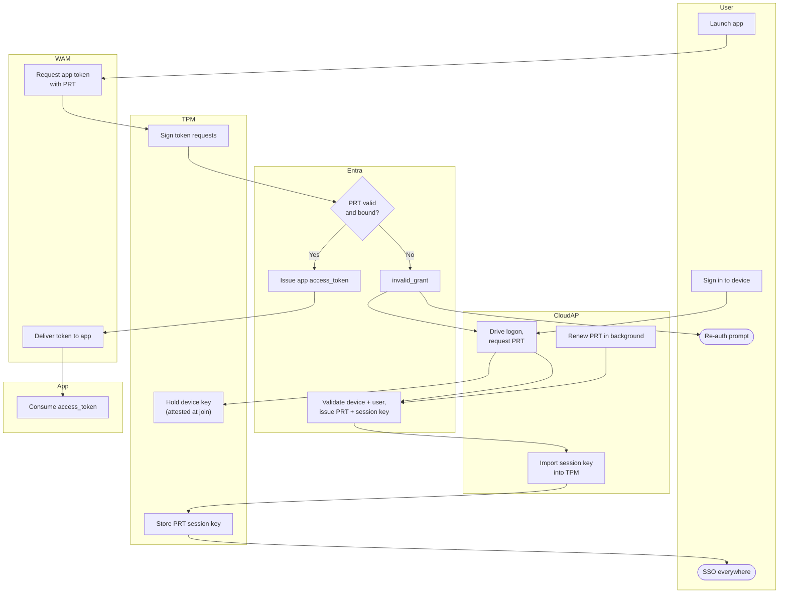

# Primary Refresh Token — Swimlane

One lane per component. The TPM lane holds device and session keys; token requests are
always signed there before reaching Entra.

Notes

- The `T3 --> E2` edge is the proof-of-possession: every app-token request is signed with
  the TPM-held session key, so a copied PRT is useless off the device.
- Background renewal (`C3 --> E1`) keeps SSO alive without user interaction until the PRT
  is invalidated by password change, device disable, or a CA revoke.
